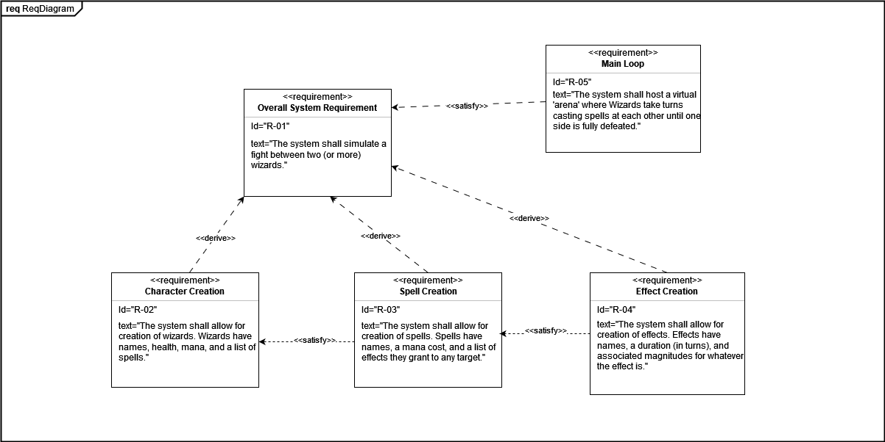
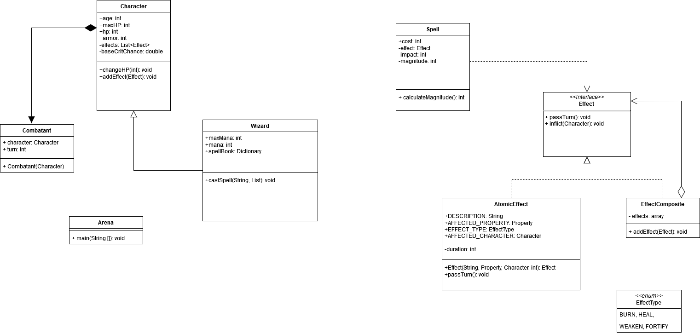

# WizBiz
WIZARD FIGHT

Simulates a random fight between two wizards. Implemented using the Template and Composite design patterns.

Template design pattern dictated the polymorphism of Characters vs. Wizards, to allow for other types of combatants to be added in the future (i.e. summonable creatures, zombies).
Composite design pattern was followed for the Effects functionality, allowing different numbers of effects to be tracked and added to characters and spells dynamically.

# Requirements Diagram

# Class Diagram

